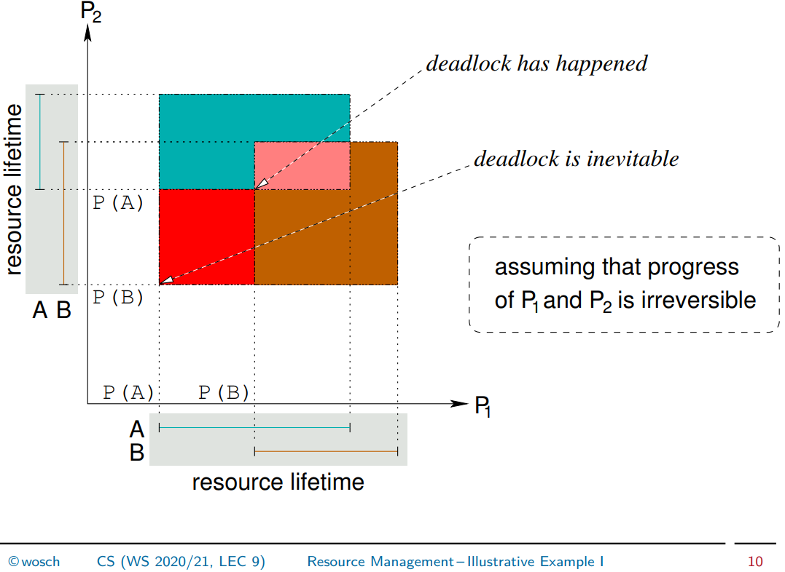
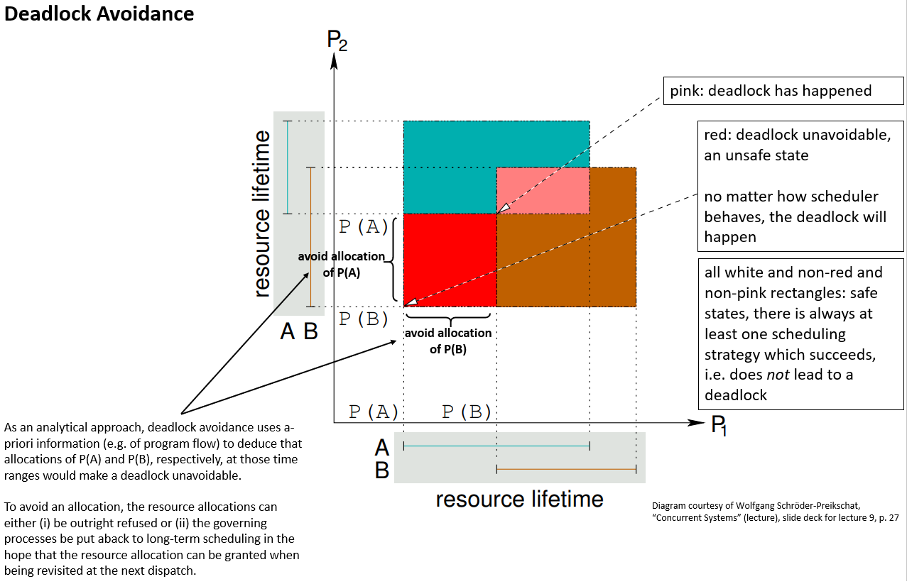

## Deadlocks, Livelocks

**Pattsituation**

- kreuzweise Ressourcenallokation (wiederverwendbarer Ressourcen)
- kreuzweise Signalisierung und Warten (auf konsumierbarer Ressourcen)
- vergessene Ressourcenfreigabe

**Deadly Embrace:** "interacting processes mutually wait on the occurrence of conditions that can be induced only by other processes of this very group"

- sleeping (**Deadlock**): Deadlock ("sleeping deadly embrace"): Programmzähler bleibt konstant, Prozesszustand ist blockiert, Prozess gibt Prozessor ab; kleineres Übel, da Prozesse typischerweise einen Ressourcenverwalter (z.B. BS) über Warten benachrichtigen (→ deadlock detection)
- awake (**Livelock**): Programmzähler variiert, Prozesszustand ist laufend/bereit

**Voraussetzungen für Deadlock**

- notwendig:

  1. Exklusive Ressourcenallokation (d.h. mit wechselseitigem Ausschluss)
  2. Iterative Anforderung
  3. Keine Präemption der Ressourcen
- notwendig *und* hinreichend

  4. zirkuläres Warten

**Deadlock Prevention,** konstruktive Methoden zur Entkräftung der notwendigen Bedingungen:

1. Nichtblockierende Synchronisation, atomare ISA-Befehle
2. Alle benötigten Ressourcen in einem Zug atomar (für andere Prozesse) allokieren
3. Virtualisierung von Ressourcen
4. Totalordnung für Ressourcenallokation

**Deadlock Avoidance,** analytische Methoden zur Vermeidung der vierten Bedingung durch **a-priori Informationen** und kontinuierliches Überwachen der Ressourcenallokation

Nachteile: a-priori Informationen (auf general-purpose Systemen hoffnungslos), skaliert schlecht

**Deadlock Detection**

- Wartegraphen regelmäßig auf Zyklen untersuchen und diese brechen:
  - Prozess terminieren
  - Ressource entziehen und Prozess zum letzten Checkpoint zurückkehren lassen

  Prozesse müssen das unterstützen/immun dagegen sein.
- Überprüfungszeiten nach Heuristiken (z. B. nach Antwortzeit/Durchsatz/Idlezeit)

**Livelock vs Starvation** (meine Überlegung!)

- in beiden Fällen variiert Programmzähler
- Starvation mit geeigneter Planerstrategie auflösbar; Livelock nicht.