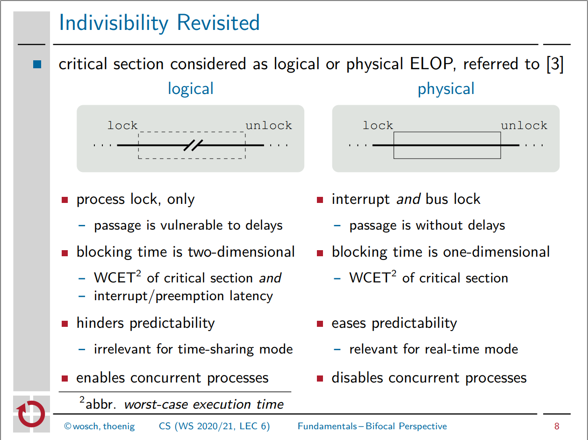
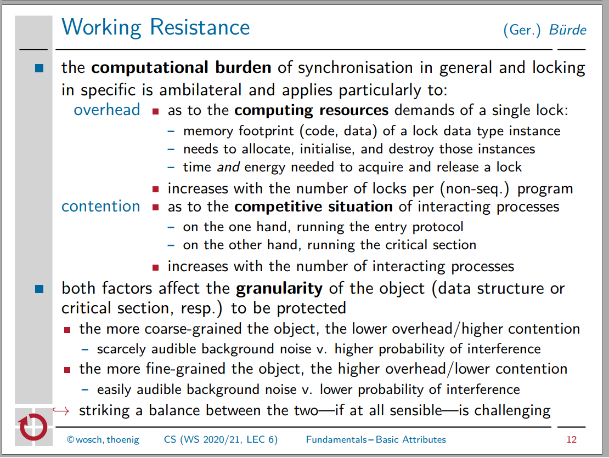

# Locks

Probleme:

- **priority inversion:**

- **lock holder preemption:** Problem, dass der Prozess, der Lock hält, verdrängt wird
  - Blockierzeit wird vergrößert
  - wenn andere Prozesse auf unlock warten, so tun sie das dann vergeblich

## Ebene, auf der gelocked wird



## Größe kritischer Abschnitte



Je größer der kritische Abschnitt, desto

- weniger fallen Eintritts- und Austrittsprotokoll ins Gewicht
- desto mehr werden einzelne Prozesse verzögert (da mehr Wettstreit)

Je kleiner der kritische Abschnitt, desto

- fallen Eintritts- und Austrittsprotokoll ins Gewicht
- desto weniger werden einzelne Prozesse verzögert (da weniger Wettstreit)

⇒ Informatikfolklore "kritische Abschnitte so klein wie möglich" zu pauschal!

Feingranulare krit. Abschnitte ähneln nichtblock. Synchr. sowieso ⇒ lieber nichtblock. Synchr. verwenden

## Varianten

- Spinlocks: Befehlssatzebene benutzen zum busy-waiten
  - Lese-/Schreibsperren
    - kommen mit atomaren Lese-/Schreibbefehlen aus
    - haben keine RMW-Zyklen (⇒ weniger Overhead statt atomare RMW Maschinenbefehle)
    - benötigen Vorwissen über Maximalzahl `N` an Prozessen; kompliziert für `N > 2`
  - Umlaufsperren mit atomaren Befehlen (CAS,   TAS, LL/SC, ...)
    - atomare Befehle garantieren oft Speicherkohärenz ⇒ Cacheprotokollaufwand
    - atomare Befehle benutzen Buslock für RMW-Zyklus (Bandbreitenverlust für selbst unbeteiligte Prozesse)
    - Extremfall: Buslock Bursts durch Gleichtakt versch. Prozesse

  - **Gemeinsame Nachteile:**
    - **Cacheeffekte**
    - **Lockholder Preemption**: der, der Lock hält, wird verdrängt zugunsten eines Prozesses, der womöglich das Lock acquirieren will (was sowieso unmöglich ist ⇒ sinnlose Einlastung)
    - **Prioritätsverletzung/-umkehr, Interferenz:**: Reihenfolge des Eintritts (etwa wegen Backoffzeiten oder Ticketlock) konkurriert mit Schedulerentscheidungen ⇒ Schedulerplan führt zu unnötigen Einlastungen
- Sleeping locks: Syscalls zum passiven Warten nutzen ⇒ Syscalloverhead, grobe kritische Abschnitte wichtig

  - Vorteil: Planer kann Wissen ausnutzen

**Benchmark:** kein echter Gewinner

- Ticketlock skaliert schlecht
  - wenn `#Prozesse > #CPU-Kerne` (dann wohl zu viel Prioritätsverletzung mit Planer?)
  - und auch wenn die falschen (nicht proportionalen) Backoffstrategien benutzt werden
- `pthread` Mutexe erstaunlich schnell trotz Syscalls

## Lese-/Schreibsperren

```c
struct lock_t { bool want[2]; bool turn; }
```

- Dekker

  ```c
  void lock(lock_t *bolt) {
    bolt->want[self] = true;           // I want to enter

    while(bolt->want[other]) {         // while the other one also wants to enter
      if (bolt->turn != self) {        // if it's their turn _for entering_, ...
        bolt->want[self] = false;      //    back off with my intention
                                       //    to allow the other one to enter
        while (bolt->turn != self);    //    wait until it's my turn
                                       //    (the other one now locked and unlocked)
        bolt->want[self] = true;
      }
    }
  }

  void unlock(lock_t *bolt) {
    bolt->want[self] = false;
    bolt->turn = other;
  }
  ```

- Peterson Lock

  ```c
  void lock(lock_t *bolt) {
    bolt->want[self] = true;
    bolt->turn = self;           // altruistic: my turn _for waiting_
    while (bolt->want[other] && bolt->turn == self);  // loop if the other one wants to enter
                                                      // and it's my turn of waiting
  }
  
  void lock(lock_t *bolt) {
    bolt->want[self] = false;
  }
  ```

  Beachte: `bolt->turn` hat unterschiedliche Semantik bei Dekker bzw. Peterson ("for entering" bzw. "for waiting").

- Kessel: single-writer anstatt wie oben lesend+schreibend auf gemeinsame Variable (Cache-ineffizient)


## Locks mit atomaren Maschinenbefehle

```c
void unlock(lock_t *bolt) {
  bolt->busy = false;
}
```

### Spin on TAS

```c
void lock(lock_t *bolt) {
  // unconditionally write 1; loop if 1 before
  while (TAS(&bolt->busy)); 
}
```
- sehr Cache-ineffizient: ständige write-invalidate/updates; für N ttstreitige Prozesse `N - 1` folgende Cachemisses/-update requests
- sehr Bus-ineffizient: ständige Buslocks (→ selbst unbeteiligte Prozesse kommen "bandwidth loss" ab)

### Spin on CAS

```c
void lock(lock_t *bolt) {
  while (!CAS(&bolt->busy, false, true));
}
```
- genauso Bus-ineffizient wie TAS

### Spin on CAS & Read

```c
void lock(lock_t *bolt) {
  do {
    while (bolt->busy);
  } while (!CAS(&bolt->busy, false, true));
}
```
- Immer noch Buslock Bursts bei "zu regulären" Programme (Single Program Multiple Data) im "Gleichtakt"

### Spin on CAS & Read, with Backoff

```c
void lock(lock_t *bolt) {
  // back off while busy-as-read or CAS failed
  // useful for processors without caches, unneccesary for processors with caches
  while(bolt->busy || !CAS(&bolt->busy, false, true)) {
    ɛ = backoff(ɛ, self);
  }
}
void lock(lock_t *bolt) {
  // loop while busy-as-read or (CAS failed and then back offed)
  while (bolt->busy || (!CAS(&bolt->busy, false, true) && ɛ = backoff(ɛ, lf), true));
}
```
- `backoff(ɛ, self)` statische (konstante Funktion), dynamische Backoffzeit
  - implementiert als `while (counter--);` oder mit Hardwaretimeout + HALT` Instruktion (nur privilegierter Modus)
- Backoff schlecht für sehr lange kritische Abschnitte (erhöht sich etwa auch ohne Wettstreit, nur wenn ein anderer Prozess den kritischen Abschnitt länger belegt.)
- Immer noch Buslock Bursts bei SPMD und nicht-randomisierten Backoffs möglich

### Backoffverfahren

- statisch
- dynamisch: "rely on feedback" ("upon failure, incrase time"), z.B. ponentiell mit Oberschranke oder randomisiert (s. ALOHA-Protokoll bei Ethernet)
- proportional (Backoffzeit wird linear aus Information der *Anzahl an konkurrierenden Prozesse* bestimmt \[Rückkopplung\]; Ticketlock)


### Ticketlock

```c
struct lock_t {
  bool busy;
  int this;
  int next;
}
void lock(lock_t *bolt) {
  int self = FAA(&bolt->next, 1);
  if (self < bolt->this) {
    // crit. sect. exec. time
    backoff((bolt->this - self) * cset); 
    while (bolt->this < self);
  }
}
void unlock(lock_t *bolt) {
  FAA(&bolt->this, 1); // actually, divisible RMW would be sufficient
}
```
**Vorteile:**
  - **verhungerungsfrei**, Fairness (FCFS)
  - Bei gut bestimmbaren a-priori-Abschätzungen, Backoffzeit sinnvoll angebbar (anstatt etwa nur dynamisch exponentiell)

**Nachteile:**
  - **Prioritätsverletzung**/-Interferenz mit Planer: FCFS <-> Schedulerstrategie
  - **Cacheineffizienz**
    - **false sharing:** die Cacheline mit `bolt->this` wird auch invalidiert, wenn `bolt->next` aktualisiert wird; und `lock` greift in Schleife auf `bolt->this` zu ⇒ Padding zwischen struct-Members erzwingen
    - **Invalidierung von `bolt->this` im Cache aller `N - 1` Prozesse/oren**, auf denen `lock` läuft, wenn der `N`-te ein `unlock` macht; und das obwohl sowieso nur ein Prozess fortschreiten würde; führt zu `N-1` Cacheinvalidierungen, ggf. seriell in Hardware! ⇒ MCS-Lock

      (Analogie des Problems: bei realen Wartemarkenspendern ertönt manchmal ein Ton, wenn die nächste Person dran ist; hier erfahren auch alle Menschen die Ineffizienz auf der digitalen Tafel die neue Nummer sich anzusehen)
  - (Überlauf Ticketzähler: mit 64 Bit ausgeschlossen)

### MCS Lock

Verallgemeinern Zähler des Ticketlocks zu FIFO-Queue; jeder Queueeintrag korrespondiert zu Prozess und hat *eigenes* Flag zum Spinnen<br>
⇒ `unlock` triggert nur noch Cache Invalidation für einen Prozess(or)

**Vorteil:** verhungerungsfrei, Fairness (FCFS), **spinnen auf Variable, auf die nur dann geschrieben wird, wenn Prozess an der Reihe ist** (⇒ cacheeffizienter als Ticketlock)

**Nachteil:** jeder Prozess benötigt prozesslokalen Queueeintrag, macht API komplizierter.

```c
struct mcs_node { mcs_node *next; bool waiting; };
struct lock_t   { mcs_node *tail; };

void lock(lock_t *bolt, mcs_node *q) {
  q->next = q->waiting = 0;

  mcs_node *pred = atomic_exchange(&bolt->tail, q);
  if (pred) {
    q->waiting = 1;
    pred->next = q;
    
    while (q->waiting);
  }
}

void unlock(lock_t *bolt, mcs_node *q) {
  if (q->next == NULL) { // if condition for optimization only
    if (CAS(&bolt->tail, q, NULL)) {  // we were last, nobody contended for lock
      return;
    }
  }
  while (!q->next);      // tail was advanced, wait for change to `next` to happen
  q->next->waiting = 0;
}
```
```
✓ and ⌛ stand for passable being true and false, respectively.
q stands for the second argument passed to lock and unlock, respectively.

lock(bolt, Z)
─────────────────────
                               X✓─►Y⌛
                                     ▲
                          tail ──────┘


                     
pred = xchg(tail, q)       X✓─►Y⌛   Z?
                                     ▲
                          tail ──────┘


q->waiting = true           X✓─►Y⌛  Z⌛
                                     ▲
                          tail ──────┘


pred->next = q              X✓─►Y⌛─►Z⌛
                                     ▲
                          tail ──────┘


while(q->waiting);               ⌛
```

```
unlock(bolt, X)
─────────────────────

                           X✓─►Y⌛─►Z⌛
                                    ▲
                         tail ──────┘


q->waiting = false         X✓─►Y✓─►Z⌛
                                    ▲
                         tail ──────┘


q becomes irrelevant           Y✓─►Z⌛
                                   ▲
                        tail ──────┘
```