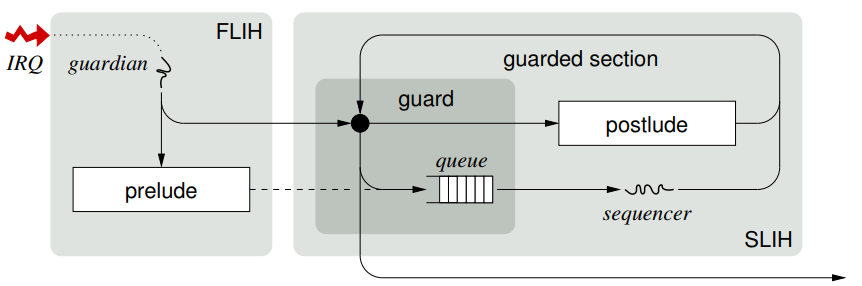

## Verifikation - CDSChecker

- gegeben: Implementierung + Testcase + Assertions
- gemacht: Laufenlassen des Testcases mit allen möglichen linearen Erweiterungen der *partial orders*

Gründe dagegen:

1. Performanz extrem schlecht
2. geringe Vertrauenswürdigkeit (wenig benutzte akademische Software?)
3. skaliert schlecht mit noch so kleinen Änderungen im Quelltext (⇒ erneute Ausführung!)

Theorembeweiser erfordern viel Einarbeitung, haben aber gute Performanz, Vertrauenswürdigkeit/Transparenz von Bugs (z.B. Coq) und skalieren zumindest ein bisschen besser. 
Hoffnung: bei "(für Menschen) semantisch kleiner" Änderung im Quelltext nur "(für Menschen) semantisch kleines neues Lemma" nötig.

### Actors-Evaluation

Siehe [./exercise3.md](./exercise3.md).

## Guarded Sections

### Hardware Ebene

1. Interrupt wird angezeigt
2. Sprung zum FLIH
3. **guardian:** identifiziert Interruptquelle und ruft entsprechenden *prelude* auf.
4. **prelude:** tut das Minimalste, um Gerät Interrupt zu quittieren und reiht ggf. einen *postlude* in eine Queue ein.
5. **sequencer:** Wenn am Ende des FLIHs kein (gestackter) FLIH mehr ausstehend, nur dann wird die Queue der *postludes* abgearbeitet.

Besonderes Zugriffsmuster der Queue:

- multiple enqueue (aber nur *stacked*, nicht horizontal)
- single dequeue

⇒ vereinfacht (sogar wartefreie) nicht-blockierend synchronisierte Implementierung

### Software Ebene

Ungefähr analog/verallgemeinernd zu oben:

- **requester:** reiht Anfrage zur (exklusiven) Ausführung eines kritischen Abschnitts ein, bekommt *future object*, führt fort
- **future object:** kapselt Zustand (unresolved/resolved/error) + Wert + Signalisierungsmechanismus
- **sequencer:** arbeitet alle ausstehenden kritischen Abschnitte ab

Die Aufgaben des sequencer können entweder immer mal wieder von requestern eingenommen werden bei Anfragen oder dezidiert von einem Prozess übernommen werden (siehe auch (\*) unten).

Guarded Sections sind

- ≈ asynchronous/delegated critical sections
- ≈ Executor Service mit einem Arbeiter (\*)
- ≈ Spezialfall eines Programmiermodells mit asynchronen Funktionsaufrufen und Future-Objekten ("Promises") 
  ⇒ Vermeidung der "callback hell"